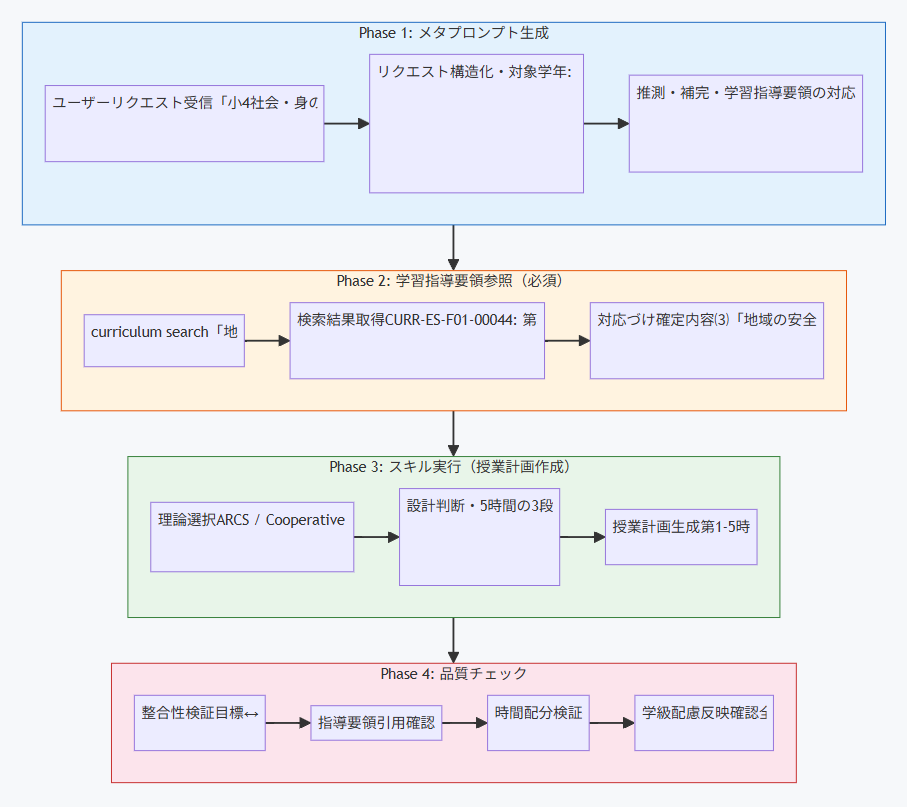

# あなたの授業準備は、どこから始まりますか？

教科書を開いて、学習指導要領を確認して、指導案のテンプレートに書き込んで——。

「これで本当にいい授業になるのか」と思いながら、締め切りに追われて提出する。ベテラン教員なら経験と勘でカバーできることも、若手教員や教育実習生にとっては毎回が手探りです。

もし、あなたの授業設計を **教育理論と学習指導要領の両方から裏づけてくれるパートナー** がいたら、どうでしょうか。

この記事では、GitHub Copilot Agent Skills「**SHIDEN（師伝）**」を使って、教育がどう変わるのかを紹介します。

# SHIDENとは何か

SHIDEN（師伝）は、教育者向けの GitHub Copilot Agent Skills パッケージです。

:::note info
**SHIDEN（しでん）** — 「師」から「伝」える。教育者の専門知を次の世代に伝えるという意味を込めています。
:::

ひとことで言うと、**「教育理論と学習指導要領を内蔵した、授業設計のAIアシスタント」** です。

| 内蔵データ | 規模 |
|-----------|------|
| 教育理論データベース | 175件（10カテゴリ、FTS5日本語全文検索対応） |
| 学習指導要領データベース | 2,469セクション（小・中・高） |

一般的なAIアシスタントとの最大の違いは、**エビデンスに基づいた教育コンテンツを生成した後、その設計プロセスを可視化してファイルに保存する**点にあります。

# なぜ「プロセス」が重要なのか

ここがSHIDENの核心です。

一般的なAIツールに「授業計画を作って」と依頼すると、完成品だけが返ってきます。しかし、教育のプロにとって重要なのは **「なぜその設計にしたのか」** です。

- なぜこの学習目標にしたのか
- 学習指導要領のどこに対応しているのか
- どの教育理論を、なぜ選んだのか
- 他にどんな選択肢があって、なぜ今回は採用しなかったのか

SHIDENは、まず成果物を提示し、その後で**思考のプロセスをすべて可視化し、ファイルに保存します**。

これは単なる「透明性」ではありません。**教師力を高めるための仕組み**です。

> 現役の教員は、自分の設計判断をSHIDENの提示と比較することで、新しい視点を得られます。
> 教員を目指す学生は、プロの授業設計がどう組み立てられるかを、実例を通して学べます。

# SHIDENの出力フロー

SHIDENがコンテンツを生成するとき、以下の順序で出力します。

```
┌─────────────────────────────────────────┐
│  ★ Artifact          — 最終成果物（先）  │
├─────────────────────────────────────────┤
│  1. Intake Summary   — 条件整理          │
│  2. Curriculum Lookup — 指導要領検索     │
│  3. Theory Selection  — 理論選定        │
│  4. Design Decisions  — 設計判断        │
│  5. Quality Check     — 品質確認        │
├─────────────────────────────────────────┤
│  💾 ファイルに自動保存                    │
└─────────────────────────────────────────┘
```

**まず成果物を見せ、次に「なぜそう作ったか」を見せる。** これがSHIDENの設計思想です。

成果物を先に見ることで、ユーザーはゴールのイメージを持った状態でプロセスを読めます。「この授業計画はこうやって組み立てられたのか」と逆引きで理解できるため、学びの定着が深まります。

---

# 実例: 小学校4年・社会科「身の回りの安全を守る」

以下は、実際にSHIDEN CLIで学習指導要領と教育理論を検索し、その結果をもとに生成した授業計画です。

以下のプロンプトを入力します。

```
小学校4年生社会科。小単元名「身の回りの安全を守る」の授業設計を支援して。
私のクラスは落ち着きのない子が多い。45分×5コマの授業を設計し、ファイルに保存。
```

教科・学年・単元だけでなく「落ち着きのない子が多い」という**学級の実態**が含まれています。SHIDENがこの情報をどう扱うかが見どころです。

## まず成果物が提示される

SHIDENはまず、完成した単元計画を提示します。

```markdown
## Artifact

### 単元計画: 身の回りの安全を守る（全5時間）

| 項目 | 内容 |
|------|------|
| 対象学年 | 小学校4年生 |
| 教科 | 社会科 |
| 小単元名 | 身の回りの安全を守る |
| 授業時間 | 45分×5コマ |
| 学級の特性 | 落ち着きのない児童が多い |
```

### 学級の特性への対応方針

SHIDENは「落ち着きのない子が多い」という情報から、単元全体の設計方針を導き出しています。

```markdown
1. 短いサイクルで活動を切り替える — 1つの活動は10〜15分以内
2. 体を動かす場面を入れる — 教室内調査、カード分類、ロールプレイ
3. 視覚教材・具体物を多用する — 写真、地図、実物で注意を引く
4. グループでの短い話し合いを核にする — Think-Pair-Shareで全員が声を出す
5. 成功体験を積み重ねる — 各時間に「できた実感」を持てる小さな成果物を設定
```

:::note info
**ここに注目:** 一般的なAIは「落ち着きのない子が多い」を無視するか一般論を付け足すだけです。SHIDENは5つの具体的な設計方針に変換し、全5時間の活動設計に一貫して反映しています。
:::

### 授業展開の例（第4時: 地域の人々の協力を調べよう）

5時間の中でも特に特徴的な第4時を見てみます。

```markdown
| フェーズ | 時間 | 学習活動 | 指導上の留意点 | 評価 |
|---------|------|---------|---------------|------|
| 導入 | 5分 | 「警察や消防以外に、安全を守っている人は？」 | 地域の具体的な人を想起させる | 発言観察 |
| 展開1 | 15分 | 見守り隊・交通安全協会・自治会をジグソー法で担当 | 1グループ1トピック（Cooperative Learning） | カード内容 |
| 展開2 | 15分 | ジグソー班を組み直し、相互に教え合う | 全員に役割がある | 相互説明の質 |
| まとめ | 10分 | 「警察・消防・地域の人々」の関係図を作成 | 3者のつながりを視覚化する | 関係図 |
```

:::note info
**なぜジグソー法なのか？** 「専門家になる→教える」構造が全員に発言義務を生み、落ち着きのない学級でも参加率が上がるからです。後のプロセスログで、なぜこの手法をこのタイミングで選んだのかが詳しく説明されます。
:::

---

## 次に、思考プロセスが可視化される

成果物の後に、SHIDENはその成果物を作るまでの全判断過程を表示します。



### Process 1: Intake Summary（条件整理）

```markdown
### 1. Intake Summary

#### 確定条件
- 対象: 小学校4年生
- 教科: 社会科
- 小単元名: 身の回りの安全を守る
- 授業時間: 45分×5コマ
- 学級の特性: 落ち着きのない子が多い

#### 推測（未確認）
- 「身の回りの安全を守る」は学習指導要領の「地域の安全を守る」に対応すると推測
- 警察・消防を中心に扱う単元と推測
- 見学活動は含まない前提（明示されていないため）
```

:::note info
**なぜ条件整理を見せるのか？**

「推測」を明示していることがポイントです。SHIDENが何を前提にしたかが見えるので、「見学活動を入れたい」「消防だけに絞りたい」といった修正が的確にできます。
:::

### Process 2: Curriculum Lookup（学習指導要領の検索）

SHIDENは内蔵の学習指導要領データベースを実際に検索し、その結果を表示します。

```markdown
### 2. Curriculum Lookup

#### 検索コマンド
npx shiden curriculum search "地域の安全を守る"
npx shiden curriculum subject 社会

#### 検索結果
- CURR-ES-F01-00044: 小学校社会 第3学年及び第4学年 目標
  「身近な地域や市区町村の地理的環境，地域の安全を守るための諸活動や
   地域の産業と消費生活の様子」
- CURR-ES-F01-00045: 小学校社会 第3学年及び第4学年 内容⑶
  「地域の安全を守る働きについて，学習の問題を追究・解決する活動を通して」

#### 本単元との対応
内容⑶「地域の安全を守る働き」に直接対応。警察・消防の仕事と地域の人々の
協力を調べ、最終時に自分たちの行動を提案する構成とした。
```

:::note info
**なぜ検索結果を見せるのか？**

検索コマンドと結果ID（CURR-ES-F01-00044等）が見えることで、「この指導要領のこの部分に対応している」という根拠が具体的にわかります。学習指導要領の読み方を実践的に学べる場面です。
:::

### Process 3: Theory Selection（教育理論の選定）

175件の理論データベースから、この単元と学級に最適な理論を選定します。**選ばなかった理論とその理由**も示すのがSHIDEN独自の強みです。

```markdown
### 3. Theory Selection

#### 採用した理論

| 理論 | 適用箇所 | 採用理由 |
|------|---------|---------|
| Keller's ARCS Model | 全5時間の導入・まとめ | 落ち着きのない学級で注意維持、身近な経験との関連づけ、毎時間の成果物で達成感 |
| Cooperative Learning | 展開部分のグループ活動 | Think-Pair-Share、ジグソー法で全員に役割を持たせ、私語を学習に転換 |
| Gagné's Nine Events | 各時間のフロー全体 | 導入→展開→まとめの3段構成を教授事象に沿って設計 |

#### 検討したが不採用とした理論

| 理論 | 不採用理由 |
|------|-----------|
| Problem-Based Learning | 4年生で落ち着きのない学級では長い探究より短いサイクルの活動が有効 |
| Self-Determination Theory | 理論的基盤として有用だが、授業設計への直接指針はARCSの方が具体的 |
| Gamification | ポイントや競争要素はこの単元の内容（安全・協力）と方向性が合わない |
```

:::note info
**なぜ不採用理由まで見せるのか？**

「ゲーミフィケーションを使わなかった理由」を知ることが教育者としての判断力に直結します。落ち着きのない学級にゲーム要素を入れたくなりますが、「安全」を扱う単元では方向性が合わないという判断。これが理論の使い分けです。
:::

### Process 4: Design Decisions（設計判断）

```markdown
### 4. Design Decisions

#### 単元構成の判断
- 5時間を「知る（1-3時）→つなげる（4時）→自分ごとにする（5時）」の3段階で構成
- 毎時間、成果物（カード、ワークシート、比較表、関係図、ポスター）を設定

#### 落ち着きのない学級への設計判断
- 1活動あたり10〜15分に制限し、メリハリをつけた
- 「聞くだけ」の時間を最小化し、書く・分類する・話し合う・発表を切り替え続ける
- 立って作業する場面（付箋分類、ポスター作成）を意図的に組み込んだ

#### なぜジグソー法を第4時に配置したか
- 第2-3時で全員が警察と消防の知識を持った状態で、第4時に新情報を加える
- 「専門家になる→教える」構造が全員に発言義務を生み、参加率が上がる
- 単元の山場であり最も集中力を要する内容なので、活動の構造で集中を維持する
```

### Process 5: Quality Check（品質確認）

```markdown
### 5. Quality Check

- [x] 目標、活動、評価が相互に整合している
- [x] 学習指導要領の参照箇所が明記されている（第2章第2節 社会 内容⑶）
- [x] 時間配分が各時間45分と一致している
- [x] 落ち着きのない学級への配慮が全5時間に反映されている
- [x] 各時間に具体的な成果物が設定されている
- [x] プロセスログが成果物の後に表示されている
- [x] ファイルに保存されている
```

---

# すべてが1つのファイルに残る

成果物とプロセスログの全体が、**1つのファイルに自動保存**されます。

```
SHIDEN_lesson-plan_20260410_身の回りの安全を守る.md
```

ファイルにはYAMLメタデータが付与され、あとから検索・参照しやすい形になっています。

```yaml
---
date: 2026-04-10
artifact_type: lesson-plan
grade: 小学校4年生
subject: 社会科
topic: 身の回りの安全を守る
theories_used: [Keller's ARCS Model, Cooperative Learning, Gagné's Nine Events]
---
```

このファイルが蓄積されることで、あなた自身の「教育設計のポートフォリオ」になります。

- 過去の授業設計を振り返れる
- 理論の使い方のパターンが見える
- 同僚や実習生との共有・フィードバックに使える

---

# 6つのユースケース

SHIDENは授業計画だけのツールではありません。教育現場で必要な6種類のコンテンツに対応しています。

## 1. 授業計画（lesson-plan）

目標・活動・評価の三位一体の指導案を生成します。

```
高校1年生の英語コミュニケーションIで「自己紹介スピーチ」の授業計画をお願いします。
50分授業、ペアワーク中心で。
```

## 2. 教材（materials）

ワークシート、スライド、小テスト、配布資料を生成します。

```
小学4年生の理科「電気の流れ」のワークシートを作成してください。
実験の手順と考察欄を含めてください。
```

## 3. 評価（assessment）

ルーブリック、テスト問題、採点基準を生成します。

```
中学3年生の社会「公民」で、ディベート活動の4段階ルーブリックを作成してください。
論理性、根拠の適切さ、発表態度を評価項目にしてください。
```

## 4. 個別指導（individual）

学習者の特性に応じた支援計画を生成します。

```
小学2年生で、ひらがなの読み書きに困難がある児童への支援計画を作成してください。
強みは口頭での表現力が高いことです。
```

## 5. フィードバック（feedback）

Growth Mindsetに基づく成長志向のフィードバックを生成します。

```
中学1年生が書いた意見文にフィードバックをお願いします。
論点は明確だが、根拠の示し方が弱い状況です。
```

## 6. 生活指導（guidance）

発達段階を考慮した指導計画と連携案を生成します。危機対応時は専門機関連携を必ず含みます。

```
中学2年生の女子で、最近急に欠席が増え、友人関係にも変化があります。
担任としての対応方針を整理したいです。
```

:::note warn
**安全上の注意**: 自傷、いじめ、虐待等の危機的状況が疑われる場合、SHIDENは必ず「スクールカウンセラー、管理職、または専門機関への相談を強くお勧めします」という警告を含めます。AIの提案は専門家の判断に代わるものではありません。
:::

---

# SHIDENで教師力を伸ばす — 実践的な活用ステップ

SHIDENは「便利な授業計画生成ツール」ではありません。**使うたびに あなた自身の教育設計力が上がる仕組み**を内蔵しています。ここでは、経験年数や立場に応じた活用方法を解説します。

## ステップ1: まず「比較」から始める（1〜2週目）

いきなりSHIDENに頼るのではなく、**自分で作った指導案とSHIDENの出力を並べる**ことから始めます。

```
【あなたのやること】
1. いつも通り、自分で指導案を書く
2. 同じ条件でSHIDENに依頼する
3. 2つを並べて、違いを見る
```

注目すべきポイントは3つです。

| 比較ポイント | 見るべきこと |
|-------------|------------|
| **理論の選択** | 自分が無意識に使っていた手法に名前がついていたか？ SHIDENが選んだ理論を知っていたか？ |
| **不採用理由** | SHIDENが「使わなかった理論」の中に、自分が使おうとしていたものはあるか？ その理由に納得できるか？ |
| **学級への配慮** | 自分の設計と、SHIDENの設計で、学級の実態への対応はどう違うか？ |

:::note info
**ポイント:** この段階では、SHIDENの出力が「正解」ではありません。**違いに気づくこと自体が学びです。** 「なぜSHIDENはこう判断したのか」「自分の判断とどちらが良いか」を考えるプロセスが、教育設計の言語化力を高めます。
:::

## ステップ2: プロセスログを「教育理論の教科書」として読む（3〜4週目）

SHIDENのプロセスログには、毎回異なる理論が登場します。これを**意図的に読む習慣**をつけます。

```
【週に1回やること】
1. 保存されたファイルから、Theory Selectionセクションを開く
2. 「採用した理論」を1つ選び、その理論について10分だけ調べる
3. 次の授業設計で、その理論を意識して使ってみる
```

175件の理論データベースがあるため、SHIDENを使い続けるだけで多様な理論に触れられます。しかし「触れる」だけでは身につきません。**1つの理論を選んで深堀りする**ことで、自分のレパートリーに変化が起きます。

### 理論の学び方の例

先ほどの実例では「Cooperative Learning」が採用されました。この理論を深堀りするなら:

```
SHIDENのCLIで理論を直接検索:
npx shiden theories search "cooperative"
npx shiden theories get theory-109

→ 理論の概要、主要な研究者、教育場面での活用方法が表示される
→ 「ジグソー法」「Think-Pair-Share」「相互教授法」などの具体的な技法がわかる
→ 次の授業で1つの技法を試してみる
```

## ステップ3: 「条件を変えて再設計」で判断力を鍛える（1ヶ月目〜）

同じ単元でも、条件を変えるとSHIDENの設計判断は変わります。**条件を意図的に変えて比較する**ことで、「なぜこの条件ではこの設計になるのか」という判断力が磨かれます。

```
【同じ単元で条件を変えてみる】

パターンA: 「落ち着きのない子が多い」
パターンB: 「発表が苦手な子が多い」
パターンC: 「特別支援学級との交流授業」
```

3つの出力を並べると、以下のような違いが見えます。

| 条件 | 理論の変化 | 活動の変化 |
|------|-----------|-----------|
| 落ち着きのない学級 | ARCS（注意維持）、Cooperative Learning | 短サイクル、体を動かす活動 |
| 発表が苦手な学級 | Scaffolding、Zone of Proximal Development | 段階的な発表練習、ペアでのリハーサル |
| 交流授業 | Universal Design for Learning、Differentiated Instruction | 複数の表現手段、柔軟なグルーピング |

:::note info
**この練習が効く理由:** 「同じ教材で条件だけ変える」のは、ベテラン教員が頭の中で無意識にやっていることです。SHIDENを使うと、その判断過程が文字として残るため、**暗黙知を形式知に変換する訓練**になります。
:::

## ステップ4: ポートフォリオを振り返る（学期末）

SHIDENで生成したファイルが蓄積されると、あなた実践の記録が自動的に出来上がっています。

```
SHIDEN_lesson-plan_20260410_身の回りの安全を守る.md
SHIDEN_lesson-plan_20260415_電気の流れ.md
SHIDEN_materials_20260420_一次関数ワークシート.md
SHIDEN_assessment_20260501_ディベートルーブリック.md
SHIDEN_lesson-plan_20260510_古文の世界.md
...
```

学期末に、これらのファイルの**Theory Selectionセクションだけを横断的に読む**ことをお勧めします。

```
【学期末の振り返り】
1. 自分がよく使う理論は何か？ → 得意パターンが見える
2. 一度も使っていない理論カテゴリは？ → 盲点が見える
3. 学級の実態への対応方針は変化したか？ → 成長が見える
```

## 立場別の活用ガイド

### 教育実習生・新任教員

**目標: 教育設計の「型」を身につける**

- まずSHIDENに作ってもらい、その構造を真似て自分で書く
- プロセスログの「なぜこの構成にしたか」を読み込む
- 理論の名前と適用場面を1つずつ覚えていく
- 指導教官に見せるとき、SHIDENの出力と自分の修正点を一緒に示す

### 中堅教員（5〜15年）

**目標: 自分の実践を理論で裏づける**

- 自分の指導案を先に作り、SHIDENの出力と比較する
- 「自分が無意識に使っていた手法」に理論名がつく体験をする
- 不採用理由を読み、自分の理論レパートリーの偏りに気づく
- 校内研修で、SHIDENのプロセスログ形式を使って指導案を検討する

### ベテラン教員・指導主事

**目標: 暗黙知を次世代に伝える**

- 自分の授業設計をSHIDENに入れ、プロセスログの言語化を参考にする
- 「なぜこの展開にしたのか」を言語化する訓練として使う
- 若手の指導案にSHIDENの出力を添えて、理論的な観点からフィードバックする
- 条件を変えた比較出力を使い、「状況に応じた判断」を研修で教材化する

---

# 一般的なAIツールとの違い

「ChatGPTやCopilot Chatでも授業計画は作れるのでは？」という疑問に答えます。

| | 一般的なAI | SHIDEN |
|---|-----------|--------|
| 学習指導要領 | 参照しない | **2,469セクション内蔵、自動引用** |
| 教育理論 | 知識はあるが体系的でない | **175件のDB、選定理由と不採用理由を表示** |
| 質問の仕方 | まとめて複数聞く | **1問1答で、必要な情報だけ確実に収集** |
| 出力形式 | 毎回異なる | **スキル別テンプレートで一貫** |
| 思考プロセス | 見えない | **成果物の後にプロセスログを表示** |
| ファイル保存 | しない | **自動保存、メタデータ付き** |
| 品質チェック | しない | **品質ゲートで自己検証** |

最も大きな違いは「**プロセスが残る**」ことです。

完成品だけを受け取るツールでは、使う側の力は上がりません。SHIDENは「なぜそう設計したのか」を毎回見せることで、使えば使うほどあなた自身の教育設計力が上がるように設計されています。

---

# 始め方

## 必要な環境

- **Node.js** 20.0.0以上
- **VS Code** + GitHub Copilot拡張機能

## インストール（3ステップ）

```bash
# Step 1: インストール
npm install shiden

# Step 2: 初期化（スキルファイルをプロジェクトへコピー）
npx shiden init

# Step 3: VS CodeでCopilot Chatに話しかける
```

```
@workspace 小学校4年生社会科「身の回りの安全を守る」の授業計画を作成してください
```

これだけです。Docker不要、外部サービス不要、ゼロコンフィグで始められます。

## 更新

```bash
npm update shiden
npx shiden update
```

---

# よくある質問

**Q. プログラミングの知識は必要ですか？**
A. `npm install` と `npx shiden init` の2コマンドだけです。それ以降はVS Code上で日本語で話しかけるだけです。

**Q. 大学の授業でも使えますか？**
A. はい。学習指導要領の自動参照は小中高が対象ですが、教育理論の適用や授業設計の枠組みは大学の講義設計にも使えます。

**Q. 生成された内容はそのまま使えますか？**
A. 実用可能な粒度を目指していますが、最終的には教育者ご自身の専門的判断で調整してください。AIは補助であり、教育の主体はあなたです。

**Q. 費用はかかりますか？**
A. SHIDEN自体はMITライセンスで無料です。GitHub Copilotのサブスクリプションが必要です。

**Q. オフラインで使えますか？**
A. 教育理論と学習指導要領のデータベースはローカルに内蔵されています。ただし、GitHub Copilotとの連携にはインターネット接続が必要です。

---

# おわりに

SHIDENは「教育コンテンツを自動生成するツール」ではありません。

**「教育設計の思考プロセスを可視化し、あなたの教師力を高めるパートナー」** です。

- 学習指導要領を毎回確認する習慣がつく
- 教育理論の使い分けが身につく
- 設計判断の根拠を言語化できるようになる
- 授業設計のポートフォリオが自動的に蓄積される

授業準備の時間を短縮しながら、質を高め、自分自身の成長にもつながる。それがSHIDENの目指す教育の形です。

```bash
npm install shiden
npx shiden init
```

まずは1つ、授業計画を作ってみてください。プロセスを見た瞬間、教育への向き合い方が少し変わるはずです。

---

**リポジトリ**: [GitHub - nahisaho/SHIDEN](https://github.com/nahisaho/SHIDEN)
**npm**: [shiden - npm](https://www.npmjs.com/package/shiden)
