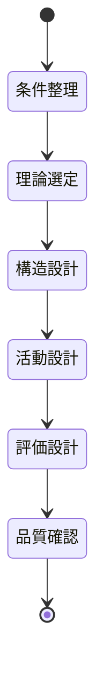

# 授業設計記録: {トピック名}

> 本ドキュメントは、授業設計のプロセスを第三者が再現・検証可能な形式で記録したものです。

---

## 1. 設計概要

### 1.1 学習目標

**主目標**:
{生徒を主語にした具体的な学習目標}

**副目標**:
- {副目標1}
- {副目標2}

### 1.2 対象学習者

| 項目 | 内容 | 情報源 |
|------|------|--------|
| 学年 | {学年} | 確定 |
| 人数 | {人数} | {確定/推測} |
| 学習者の特性 | {特性の記述} | {確定/推測} |
| 前提知識 | {前提となる知識} | {確定/推測} |

### 1.3 制約条件

| 項目 | 内容 | 情報源 | 設計への影響 |
|------|------|--------|-------------|
| 時間 | {授業時間} | {確定/推測} | {時間制約がどう設計に影響するか} |
| 環境 | {教室環境} | {確定/推測} | {環境がどう設計に影響するか} |
| リソース | {使用可能リソース} | {確定/推測} | {リソースがどう設計に影響するか} |

---

## 2. 学習指導要領との関連

> ⚠️ 小中高の授業設計では必須セクション

### 検索コマンド

```bash
npx shiden curriculum search "{検索キーワード}"
npx shiden curriculum subject {教科}
```

### 参照箇所

**学校種**: {小学校/中学校/高等学校}学習指導要領  
**章・節**: 第{章}章 第{節}節 {教科}  
**学年**: {対象学年}

**目標**:
> 「{学習指導要領の目標を引用}」

**内容**:
> 「{当該単元の内容を引用}」

**本設計との対応**:
{本授業設計が学習指導要領のどの部分にどう対応するかの説明}

---

## 3. 参照した理論・モデルの採否一覧

### 3.1 採用した理論

| # | 理論・モデル名 | 適用箇所 | 採用理由 |
|---|---------------|---------|---------|
| 1 | {理論名1} | {展開部、導入など} | {具体的な採用理由 — 省略禁止} |
| 2 | {理論名2} | {どこに適用} | {具体的な採用理由 — 省略禁止} |
| 3 | {理論名3} | {どこに適用} | {具体的な採用理由 — 省略禁止} |

### 3.2 検討したが不採用とした理論

| # | 理論・モデル名 | 不採用理由 |
|---|---------------|-----------|
| 1 | {理論名A} | {具体的な不採用理由 — 「同様の理由」禁止} |
| 2 | {理論名B} | {具体的な不採用理由 — 「同様の理由」禁止} |
| 3 | {理論名C} | {具体的な不採用理由 — 「同様の理由」禁止} |

---

## 4. 設計判断ログ

### Step 1: {決定項目名}

**決定内容**:
{何を決定したかを具体的に記述}

**根拠・エビデンス**:
{なぜその判断をしたか — 理論、研究、経験則、制約条件など}

**却下した選択肢**:

| 選択肢 | 却下理由 |
|--------|---------|
| {選択肢A} | {具体的な却下理由} |
| {選択肢B} | {具体的な却下理由} |

---

### Step 2: {決定項目名}

**決定内容**:
{何を決定したかを具体的に記述}

**根拠・エビデンス**:
{なぜその判断をしたか}

**却下した選択肢**:

| 選択肢 | 却下理由 |
|--------|---------|
| {選択肢A} | {具体的な却下理由} |
| {選択肢B} | {具体的な却下理由} |

---

### Step 3: {決定項目名}

**決定内容**:
{何を決定したかを具体的に記述}

**根拠・エビデンス**:
{なぜその判断をしたか}

**却下した選択肢**:

| 選択肢 | 却下理由 |
|--------|---------|
| {選択肢A} | {具体的な却下理由} |
| {選択肢B} | {具体的な却下理由} |

---

## 5. 設計フロー図

### 5.1 学習フロー

```mermaid
flowchart TD
    A[導入: {導入内容}] --> B[展開1: {展開1内容}]
    B --> C[展開2: {展開2内容}]
    C --> D[まとめ: {まとめ内容}]
    
    A -.-> |理論: {適用理論}| A
    B -.-> |理論: {適用理論}| B
    C -.-> |理論: {適用理論}| C
```

### 5.2 設計判断フロー（該当する場合のみ）



---

## 6. 品質チェック

### 6.1 完了チェックリスト

| # | チェック項目 | 状態 |
|---|-------------|------|
| 1 | 全ての判断に根拠が記載されている | [ ] |
| 2 | 採用理論と不採用理論の両方が記録されている | [ ] |
| 3 | 推測と確定情報が区別されている | [ ] |
| 4 | 省略表現（「詳細は省略」「同様の理由で」）がない | [ ] |
| 5 | 学習指導要領の参照が含まれている（小中高の場合） | [ ] |
| 6 | 複雑なフローには Mermaid 図が挿入されている | [ ] |
| 7 | 却下した選択肢とその理由が全ステップで記載されている | [ ] |

### 6.2 省略表現チェック

以下の表現が含まれている場合、個別記述に展開すること:
- 「詳細は省略」
- 「同様の理由で」
- 「前述の通り」
- 「上記参照」

---

## 7. 付録

### 7.1 使用した SHIDEN コマンド

```bash
# 学習指導要領検索
npx shiden curriculum search "{検索語}"
npx shiden curriculum subject {教科}

# 教育理論検索
npx shiden theories search "{検索語}"
npx shiden theories get {theory-id}
npx shiden theories related {theory-id}
```

### 7.2 参考文献

- {参考文献1}
- {参考文献2}

---

*本ドキュメントは SHIDEN design-process-log スキルにより生成されました。*
